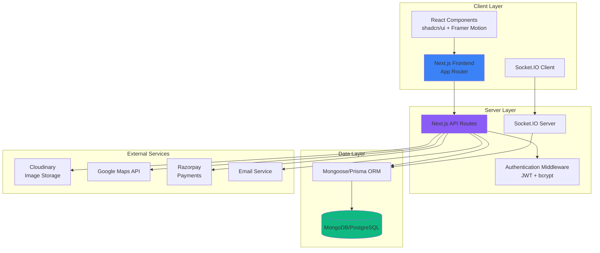
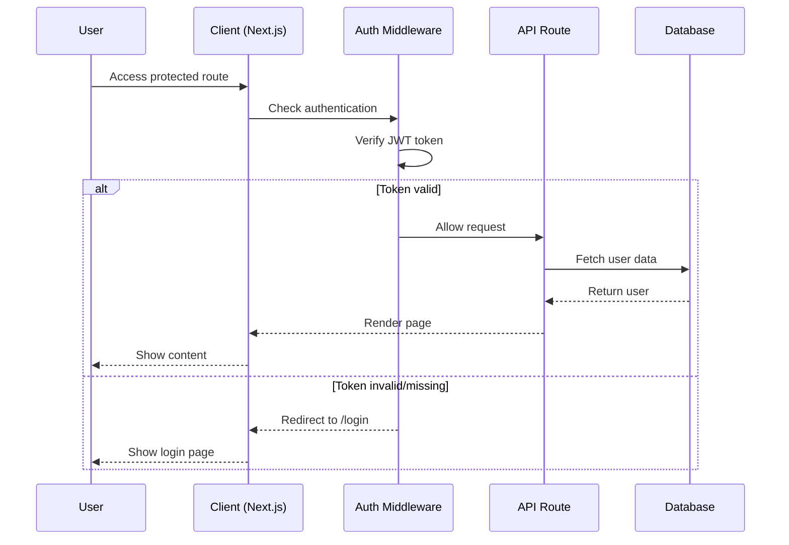
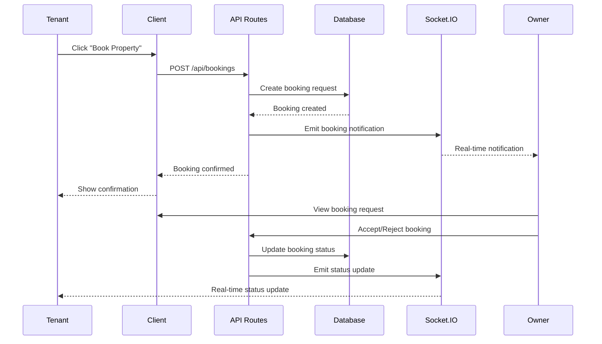

# Design Document: Smart Rental Platform

## Overview

The Smart Rental Platform is a full-stack web application that connects property owners with potential tenants through an intuitive, real-time rental marketplace. The platform supports three distinct user roles (Tenant, Owner, Admin) with role-specific dashboards and features. Built on Next.js 14+ with App Router, the system leverages modern React patterns, TypeScript for type safety, and real-time communication via Socket.IO. The architecture emphasizes responsive design, smooth animations, and production-ready performance with image optimization, lazy loading, and code splitting.

The platform enables tenants to browse, filter, and book properties while communicating directly with owners through real-time chat. Property owners can manage listings, handle booking requests, and track performance metrics. Administrators maintain platform integrity by monitoring users, managing properties, and removing spam content. The system integrates external services including Google Maps for location visualization, Cloudinary for image management, and Razorpay for payment processing.

## Architecture



## Main Algorithm/Workflow

### User Authentication Flow



### Property Booking Flow



### Real-Time Chat Flow

```mermaid
sequenceDiagram
    participant U1 as User 1
    participant C1 as Client 1
    participant S as Socket.IO Server
    participant DB as Database
    participant C2 as Client 2
    participant U2 as User 2
    
    U1->>C1: Send message
    C1->>S: socket.emit('message')
    S->>DB: Save message
    DB-->>S: Message saved
    S->>C2: socket.emit('message')
    C2-->>U2: Display message
    S-->>C1: Delivery confirmation
    
    U2->>C2: Start typing
    C2->>S: socket.emit('typing')
    S->>C1: socket.emit('typing')
    C1-->>U1: Show typing indicator
